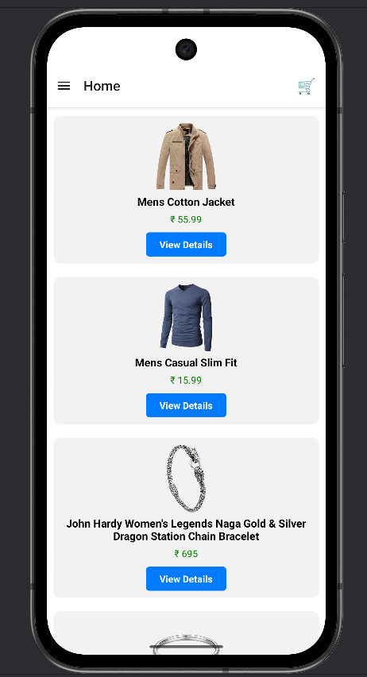
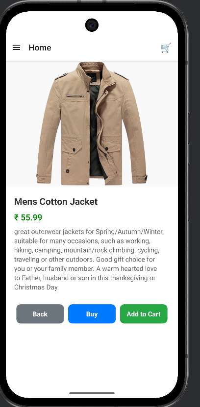
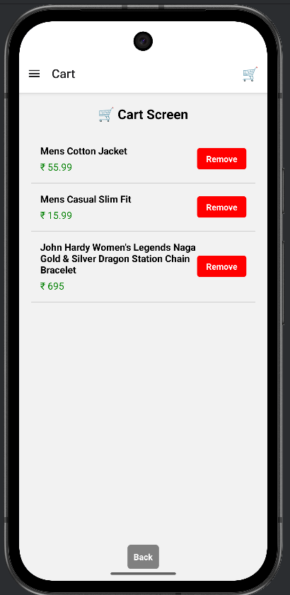
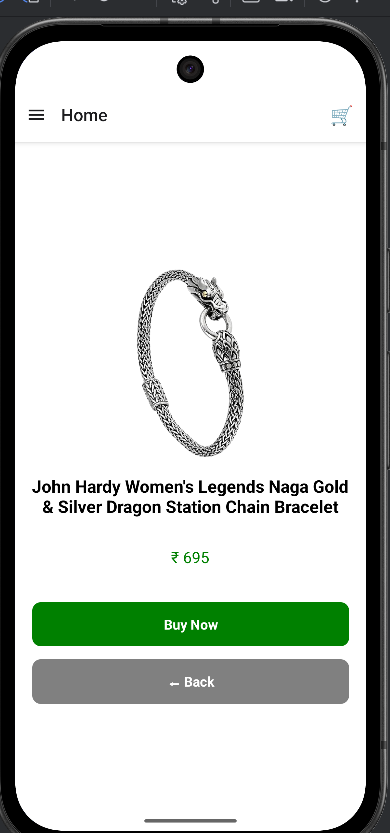

# React Native E-Commerce App 🛍️

This is a **React Native E-Commerce App** that allows users to browse, buy clothes, and manage their shopping cart. The app features a smooth navigation system with a **Drawer + Stack Navigator**, and includes functionalities like viewing product details, adding items to cart, and purchasing.

---

## Features

- Browse a list of clothing items on the **Home screen**.
- View detailed information on each product via the **Details screen**.
- Add products to the **Cart** and manage quantities.
- Navigate easily using **Drawer** and **Stack navigation**.
- Purchase items through the **Buy screen**.
- Responsive UI with **React Native components**.

---

## Screens

| Screen | Description |
|--------|-------------|
| Home | Displays a list of clothes available to buy. |
| Details | Shows detailed information about a selected product. |
| Cart | Displays items added to the cart with options to update or remove them. |
| Buy | Screen to finalize purchase of selected products. |
| Settings | App settings and preferences. |

---

## Folder Structure

- /src
-  /screens
  -  Home.js       # Main screen displaying all products
  -  Details.js    # Product details screen
  -  Cart.js       # Shopping cart screen
  -  Buy.js        # Checkout and purchase screen
  - Settings.js   # App settings screen
- /components
    - ProductCard.js # Reusable component for displaying products
  - /assets
    /images        # Images used in the app (products, icons, etc.)

## Getting Started

> Make sure you have completed the [React Native Environment Setup](https://reactnative.dev/docs/environment-setup) guide.

### Step 1: Install Dependencies

# Using npm
- npm install

# OR using Yarn
- yarn install

## Run the App for  Android
 # Using npm
- npm run android

# OR using Yarn
- yarn android

## Run the App for  IOS

- bundle install
- bundle exec pod install

# Then run
- npm run ios
# OR
- yarn ios

## App Preview

  

    <h4>Home Screen</h4>
    
  

  

    <h4>Details Screen</h4>
    
  

  

    <h4>Cart Screen</h4>
    
  

  

    <h4>Buy Screen</h4>
    
  

